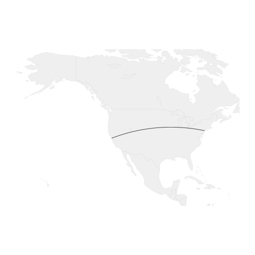
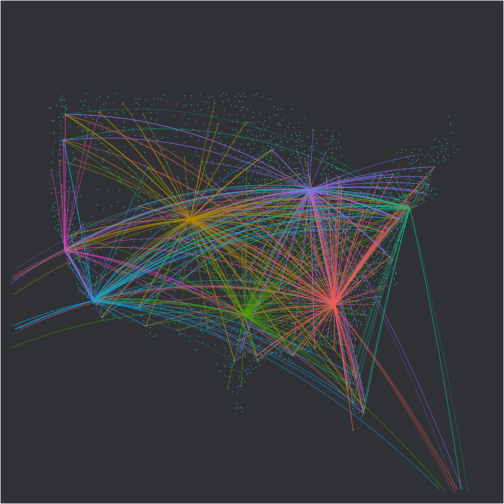
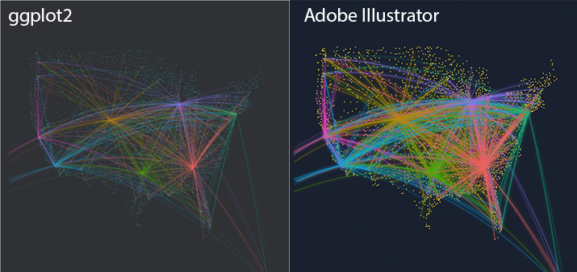
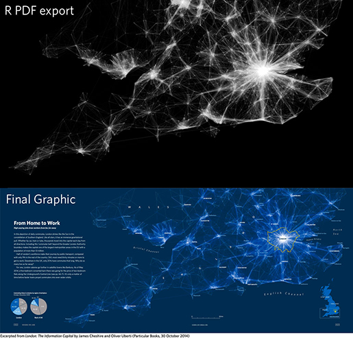
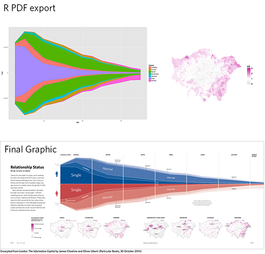

Everything you wanted to know about The Facebook Plot...
========================================================
author: Alex Adler
date: 2/6/14

...but were afraid to ask for fear of being asked to present about it tomorrow morning
========================================================


The Facebook IPO Plot illustrates ggplot's prowess
========================================================


Connecting friends across cities by Facebook (credit: Paul Butler, *Visualizing Friendships*)


What's so attractive about this plot?
========================================================

- Great Circle Arcs
- It uses ggplot2
- Cool Coloring
- No mapping package

Great Circle Arcs
========================================================
"A great circle is the largest circle that can be drawn on any given sphere.... For any two points on the surface of a sphere there is a unique great circle through the two points.""

This can be done with the geosphere library and in particular gcIntermediate()

```r
library(ggmap)
library(geosphere)
nyc<-geocode('New York City')
sfo<-geocode('San Francisco')
inter1<-gcIntermediate(nyc,sfo,n=50,addStartEnd=TRUE)
```
http://flowingdata.com/2011/05/11/how-to-map-connections-with-great-circles/


Great Circle Arcs
========================================================
"Get intermediate points on a great circle inbetween the two points used to define the great circle."


```
           lon      lat
lon  -74.00594 40.71278
     -74.94872 40.85623
     -75.89549 40.99197
     -76.84604 41.11993
     -77.80020 41.24005
     -78.75776 41.35226
     -79.71850 41.45651
     -80.68222 41.55274
     -81.64869 41.64090
     -82.61769 41.72094
     -83.58898 41.79283
     -84.56233 41.85651
     -85.53749 41.91197
     -86.51422 41.95915
     -87.49227 41.99805
     -88.47139 42.02864
     -89.45132 42.05090
     -90.43182 42.06482
     -91.41261 42.07039
     -92.39345 42.06760
     -93.37407 42.05647
     -94.35422 42.03700
     -95.33364 42.00919
     -96.31207 41.97306
     -97.28927 41.92864
     -98.26499 41.87594
     -99.23897 41.81500
    -100.21097 41.74585
    -101.18076 41.66852
    -102.14810 41.58306
    -103.11276 41.48952
    -104.07452 41.38794
    -105.03316 41.27838
    -105.98848 41.16089
    -106.94026 41.03554
    -107.88831 40.90240
    -108.83244 40.76151
    -109.77247 40.61297
    -110.70822 40.45684
    -111.63953 40.29321
    -112.56624 40.12214
    -113.48820 39.94372
    -114.40527 39.75804
    -115.31730 39.56518
    -116.22419 39.36524
    -117.12581 39.15829
    -118.02205 38.94444
    -118.91282 38.72378
    -119.79802 38.49640
    -120.67757 38.26240
    -121.55139 38.02188
lon -122.41942 37.77493
```


Great Circle Lines: An Example
========================================================
For now, let's use a map because we're only dealing with two points.


```r
library(maps)
USMap<-map_data("usa")
xlim <- c(-171.738281, -56.601563)
ylim <- c(12.039321, 71.856229)
USMap<-map("world", col="#f2f2f2", fill=TRUE, bg="white", lwd=0.05, xlim=xlim, ylim=ylim)
lines(inter1)
```

 


But that's not nearly cool enough...
========================================================


We need more points: Flying the Friendly Skies
========================================================

```r
airports <- read.csv("http://datasets.flowingdata.com/tuts/maparcs/airports.csv", header=TRUE)
flights <- read.csv("http://datasets.flowingdata.com/tuts/maparcs/flights.csv", header=TRUE, as.is=TRUE)
major<-c("ATL","LAX","ORD","DFW","DEN","JFK","SFO")
trips<-flights[flights$airport1 %in% major,]
```

Clean and arrange the data to get start and end points
========================================================


```r
library(dplyr)
USAirports<-select(airports, country=="USA", iata, lat, long)

originAirports<-flights[flights$airport1 %in% major,2]
originLocs<-USAirports[USAirports$iata %in% major,]

destinationAirports<-flights[flights$airport1 %in% major,3]
destinationLocs<-USAirports[USAirports$iata %in% destinationAirports,]
```

Now, compile all the data into a data frame for plotting
========================================================


```r
for(i in 1:nrow(trips)){
  trips$lon.origin[i]<-originLocs[originLocs$iata==trips$airport1[i],3]
  trips$lat.origin[i]<-originLocs[originLocs$iata==trips$airport1[i],2]
  
  trips$lon.dest[i]<-destinationLocs[destinationLocs$iata==trips$airport2[i],3]
  trips$lat.dest[i]<-destinationLocs[destinationLocs$iata==trips$airport2[i],2]
}
```

Now, compile all the data into a data frame for plotting
========================================================


```r
routes<-NULL
for(i in 1:nrow(trips)){
gcirc<-as.data.frame(gcIntermediate(c(trips$lon.origin[i],trips$lat.origin[i]),c(trips$lon.dest[i],trips$lat.dest[i]),n=50,breakAtDateLine=F,addStartEnd=TRUE))
gcirc$pathID<-i
gcirc$iata.origin<-trips$airport1[i]
routes<<-rbind(routes,gcirc)
}
```

A glimpse at the data frame to be plotted
========================================================


```r
head(routes,n=10)
```

```
         lon      lat pathID iata.origin
1  -97.03720 32.89595      1         DFW
2  -96.35066 32.68628      1         DFW
3  -95.66736 32.47288      1         DFW
4  -94.98733 32.25582      1         DFW
5  -94.31056 32.03513      1         DFW
6  -93.63708 31.81086      1         DFW
7  -92.96688 31.58306      1         DFW
8  -92.29997 31.35178      1         DFW
9  -91.63637 31.11707      1         DFW
10 -90.97606 30.87897      1         DFW
```

ggplot options to finish it all up
========================================================


```r
library(ggplot2)
library(grid)
p<-ggplot()+
  xlim(-130,-60)+ylim(20,56)+
  theme(plot.margin = unit(c(-1, -1, -1, -1), "cm"),
        panel.background=element_blank(),
        panel.grid.major = element_blank(),
        panel.grid.minor = element_blank(),
        plot.background=element_rect(fill="#3e4045"),
        axis.line=element_blank(),
        axis.text.x=element_blank(),
        axis.text.y=element_blank(),
        axis.ticks=element_blank(),
        axis.title.x=element_blank(),
        axis.title.y=element_blank(),legend.position="none"
        )
airports<-geom_point(data=airports[airports$country=="USA",],aes(x=long,y=lat),col='#3d838a',size=0.7)
arcs<-geom_path(data=as.data.frame(routes), aes(x=lon, y=lat,group=pathID,color=iata.origin),alpha=0.2,size=0.5)
```

Finally something a little nicer looking
========================================================


```r
p+airports+arcs
```

 

PDF export provides even more options
========================================================


Paths to illustrator:
Adding glows and changing visual aspects in a post-processing step


There's a lot of inspiration around
========================================================

http://spatial.ly/2014/11/r-visualisations-design/

And R is a powerful place to start
========================================================



http://spatial.ly/2014/11/r-visualisations-design/
