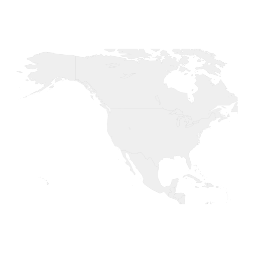

Everything you wanted to know about recreating the facebook graphic...
========================================================


...but were afraid to ask for fear of having to present it tomorrow.
========================================================


The Capabilities of Plotting in R
========================================================

Connecting friends across cities by Facebook (credit: Paul Butler, *Visualizing Friendships*)

What is striking about this plot?
========================================================

- Great Circle Arcs
- Cool Coloring
- No mapping package
- ggplot2

Great Circle Arcs
========================================================
This can be done with the geosphere library and in particular gcIntermediate()

```r
library(ggmap)
library(geosphere)
nyc<-geocode('New York City')
sfo<-geocode('San Francisco')
inter1<-gcIntermediate(nyc,sfo,n=50,addStartEnd=TRUE)
inter1
```

```
           lon      lat
lon  -74.00594 40.71278
     -74.94872 40.85623
     -75.89549 40.99197
     -76.84604 41.11993
     -77.80020 41.24005
     -78.75776 41.35226
     -79.71850 41.45651
     -80.68222 41.55274
     -81.64869 41.64090
     -82.61769 41.72094
     -83.58898 41.79283
     -84.56233 41.85651
     -85.53749 41.91197
     -86.51422 41.95915
     -87.49227 41.99805
     -88.47139 42.02864
     -89.45132 42.05090
     -90.43182 42.06482
     -91.41261 42.07039
     -92.39345 42.06760
     -93.37407 42.05647
     -94.35422 42.03700
     -95.33364 42.00919
     -96.31207 41.97306
     -97.28927 41.92864
     -98.26499 41.87594
     -99.23897 41.81500
    -100.21097 41.74585
    -101.18076 41.66852
    -102.14810 41.58306
    -103.11276 41.48952
    -104.07452 41.38794
    -105.03316 41.27838
    -105.98848 41.16089
    -106.94026 41.03554
    -107.88831 40.90240
    -108.83244 40.76151
    -109.77247 40.61297
    -110.70822 40.45684
    -111.63953 40.29321
    -112.56624 40.12214
    -113.48820 39.94372
    -114.40527 39.75804
    -115.31730 39.56518
    -116.22419 39.36524
    -117.12581 39.15829
    -118.02205 38.94444
    -118.91282 38.72378
    -119.79802 38.49640
    -120.67757 38.26240
    -121.55139 38.02188
lon -122.41942 37.77493
```
http://flowingdata.com/2011/05/11/how-to-map-connections-with-great-circles/

Great Circle Arcs
========================================================
For now, let's use a map because we're only dealing with several points.


```r
library(maps)
xlim <- c(-171.738281, -56.601563)
ylim <- c(12.039321, 71.856229)
USMap<-map_data("usa")
xlim <- c(-171.738281, -56.601563)
ylim <- c(12.039321, 71.856229)
USMap<-map("world", col="#f2f2f2", fill=TRUE, bg="white", lwd=0.05, xlim=xlim, ylim=ylim)
```

 

Great Circle Arcs
========================================================

Set up the points for airports, the origin airports, and the destination airports


```
Error in eval(expr, envir, enclos) : could not find function "select"
```
